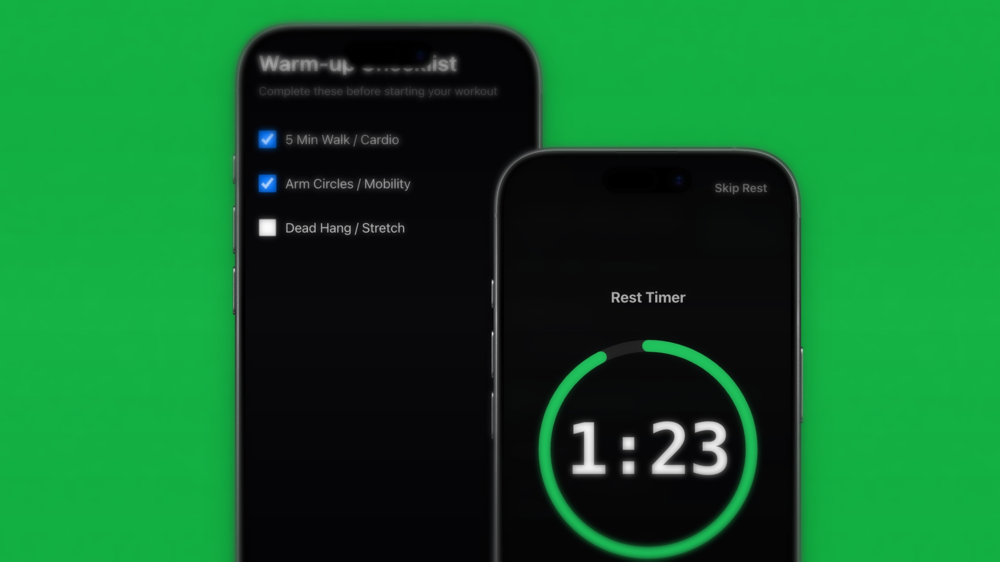
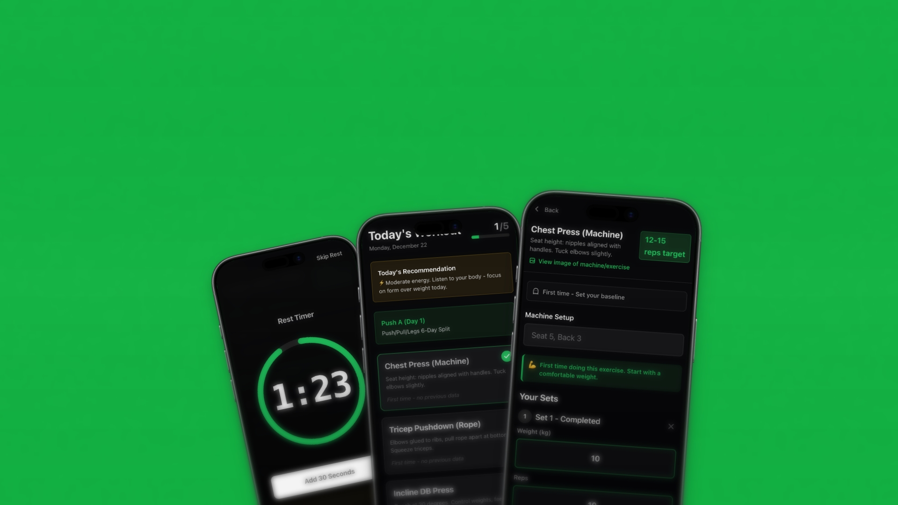

# Schwarzy

<div align="center">
  

  **A Progressive Web App for intelligent gym workout tracking**

  Track your lifts, analyze your performance, and get smart weight recommendations based on your form quality.

  [Live Demo](#) | [Report Bug](https://github.com/yourusername/schwarzy/issues) | [Request Feature](https://github.com/yourusername/schwarzy/issues)
</div>

---

## Overview

Schwarzy is a mobile-first PWA designed to revolutionize how you track gym workouts. Unlike traditional workout apps that just log numbers, Schwarzy analyzes your performance quality (the "Pain Rating" system) to provide intelligent weight progression suggestions. Built for iOS with haptic feedback, wake lock support, and offline-first architecture.

## Key Features

### Intelligent Weight Suggestions (Iron Audit)
- **Flawless execution**: Suggests +5kg for next session
- **Strong but slightly compromised**: Suggests +2.5kg
- **Compromised form**: Maintains current weight
- **Danger zone**: Recommends 10% weight reduction

### Ghost Sessions
View your previous workout data overlaid on your current session:
- Previous weights and reps
- Last session's pain rating
- Total volume comparison

### Workout Programs
- Import custom workout programs via JSON
- Automatic day-to-day rotation
- Pre-configured exercise progression

### Mobile-Optimized Experience
- **Wake Lock API**: Screen stays on during workouts
- **Haptic Feedback**: Tactile responses for all interactions
- **Touch-optimized UI**: 44px minimum touch targets, no accidental zooms
- **Dark mode only**: Easy on the eyes in the gym

### Exercise Library
Comprehensive exercise database with:
- Phase categorization (Rehab, Free Weights, Hypertrophy)
- Detailed form cues
- Rep range recommendations
- Default starting weights

### Data Management
- **100% Client-side**: All data stored in localStorage
- **Export/Import**: Backup and restore your workout history
- **No account required**: Privacy-first design

## Screenshots

<div align="center">
  
  
  
</div>

## Tech Stack

- **Framework**: [Nuxt 3](https://nuxt.com/) (SSR disabled for PWA)
- **State Management**: [Pinia](https://pinia.vuejs.org/)
- **Styling**: [Tailwind CSS](https://tailwindcss.com/)
- **Storage**: localStorage via [VueUse](https://vueuse.org/)
- **Charts**: [Chart.js](https://www.chartjs.org/)
- **Icons**: [Heroicons](https://heroicons.com/)

## Installation

### Prerequisites
- Node.js 18+
- npm, pnpm, yarn, or bun

### Setup

1. Clone the repository
```bash
git clone https://github.com/yourusername/schwarzy.git
cd schwarzy
```

2. Install dependencies
```bash
npm install
```

3. Start development server
```bash
npm run dev
```

The app will be available at `http://localhost:3000`


### PWA Installation

When accessed on mobile:
1. Open in Safari (iOS) or Chrome (Android)
2. Tap the Share button
3. Select "Add to Home Screen"
4. Launch from your home screen for full-screen experience

## Usage

### Starting a Workout

1. **Select Context**: Choose "Free Weights", "Rehab", or "Hypertrophy"
2. **Gatekeeper**: Review warm-up reminders
3. **Main Workout**: View your program or select individual exercises
4. **Exercise Tracking**: Log sets with weight, reps, and pain rating
5. **Summary**: Review total volume and session notes

### Pain Rating System

After each exercise, rate your performance:
- **Flawless (Green)**: Perfect form, felt strong
- **Strong (Blue)**: Good execution, minor fatigue
- **Compromised (Yellow)**: Form broke down, pushed too hard
- **Danger (Red)**: Risk of injury, stop immediately

### Importing Programs

1. Navigate to Settings
2. Tap "Import Program"
3. Select a JSON file following the [program format](PROGRAM_FORMAT.md)
4. Your program will be available in the workout interface

Example program structure:
```json
{
  "version": "1.0",
  "program": {
    "name": "Upper/Lower Split",
    "description": "4-day program",
    "days": [
      {
        "name": "Upper Push",
        "exerciseIds": ["bench-press", "overhead-press", "dips"]
      }
    ]
  }
}
```

## Project Structure

```
schwarzy/
├── app/                    # App entry and layouts
├── components/
│   ├── ui/                # Base UI components
│   ├── workout/           # Workout-specific components
│   └── charts/            # Data visualization
├── composables/           # Vue composables (haptic, wake lock)
├── pages/                 # Route pages
├── stores/
│   └── workout.ts         # Main Pinia store (single source of truth)
├── types/
│   └── index.ts           # TypeScript definitions
├── public/                # Static assets
├── CLAUDE.md              # Development guidance
└── PROGRAM_FORMAT.md      # Program import specification
```

## Development

### Architecture Principles

- **Client-side only**: No backend, all data in localStorage
- **Single store**: All state managed in `stores/workout.ts`
- **Mobile-first**: Touch interactions prioritized
- **Type-safe**: TypeScript with comprehensive type definitions

### Key Files

- `stores/workout.ts`: Business logic, state management, Iron Audit algorithm
- `types/index.ts`: Complete type system
- `composables/useWakeLock.ts`: Screen wake lock implementation
- `composables/useHaptic.ts`: Haptic feedback patterns

### Adding New Exercises

Edit `stores/workout.ts` and add to the `exercises` array:

```typescript
{
  id: 'new-exercise',
  name: 'New Exercise',
  phase: 'hypertrophy',
  repRange: [8, 12],
  defaultWeight: 20,
  cues: [
    'Form cue 1',
    'Form cue 2'
  ]
}
```

### iOS Touch Optimization

When adding interactive elements:
1. Use `@click.prevent` instead of `@click`
2. Add `touch-manipulation` class
3. Ensure 44px minimum size (`min-h-touch min-w-touch`)

## Contributing

Contributions are welcome! Please follow these steps:

1. Fork the repository
2. Create a feature branch (`git checkout -b feature/amazing-feature`)
3. Commit your changes (`git commit -m 'Add amazing feature'`)
4. Push to the branch (`git push origin feature/amazing-feature`)
5. Open a Pull Request

Please ensure:
- Code follows existing style conventions
- Mobile touch interactions are tested on iOS
- localStorage migrations are handled if changing data schema

## Roadmap

- [ ] Progressive overload visualization
- [ ] Exercise video demonstrations
- [ ] Rest timer with customizable intervals
- [ ] Workout history analytics
- [ ] Social sharing of PRs
- [ ] Apple Health integration

## License

This project is licensed under the MIT License - see the [LICENSE](LICENSE) file for details.

## Acknowledgments

- Exercise database inspired by evidence-based training protocols
- Pain rating system based on RPE (Rate of Perceived Exertion) research
- Icon system from [Heroicons](https://heroicons.com/)

---

<div align="center">
  Made with 💪 by the Schwarzy team

  [Website](#) | [Twitter](#) | [Discord](#)
</div>
